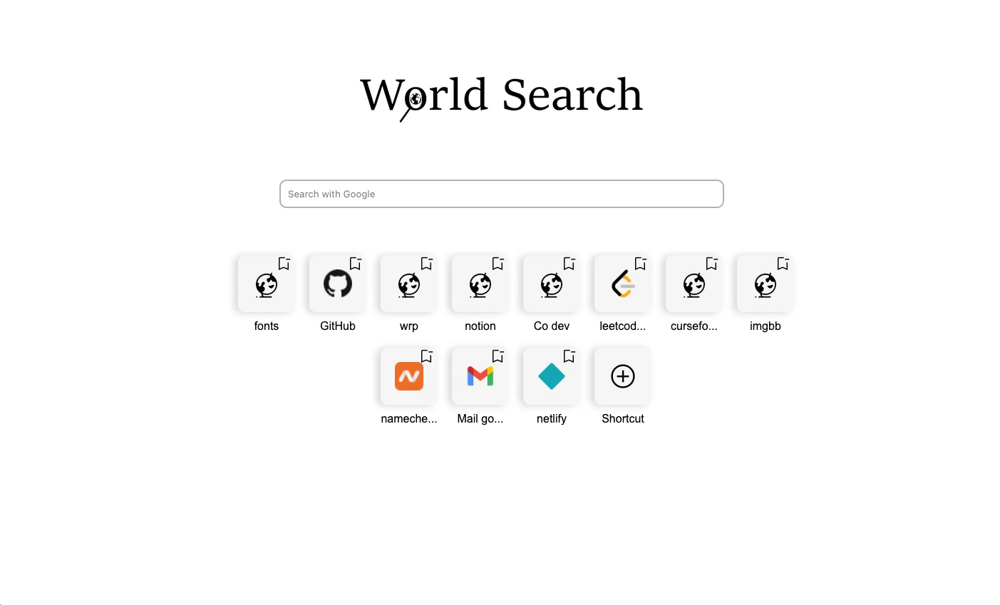

[Firefox addon](https://addons.mozilla.org/de/firefox/addon/world-search/)

## World Search

World Search is actually structured like the new tab. You can search with five searches or add unlimited shortcuts. The project is still under development, updates will follow.